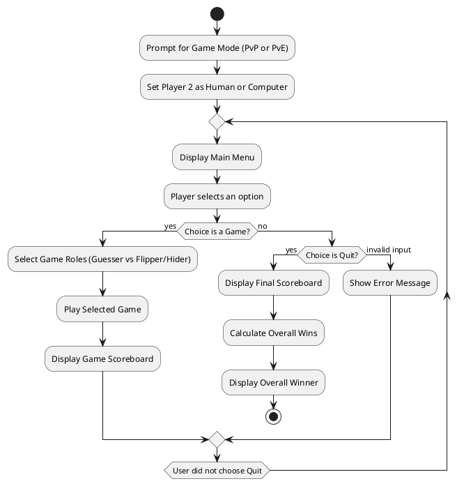
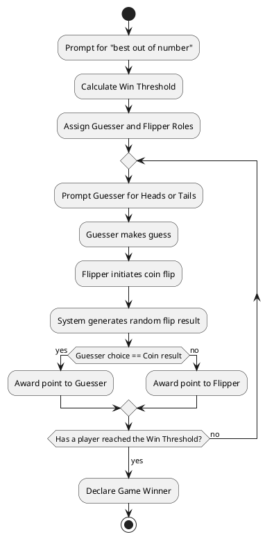
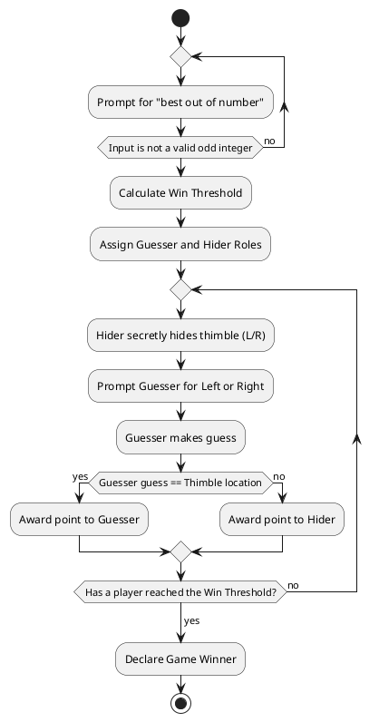
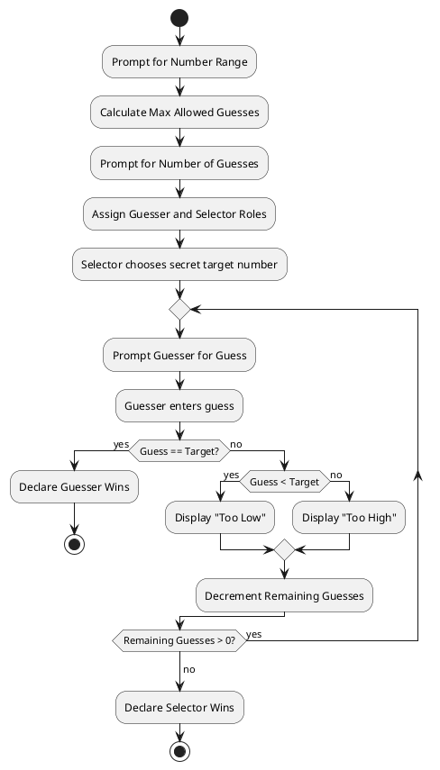
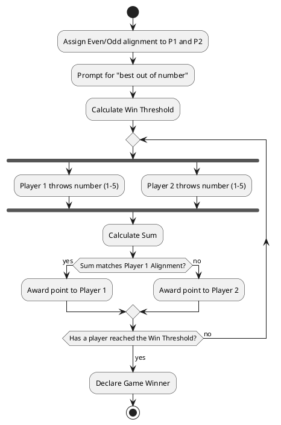
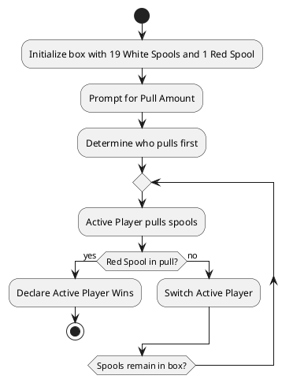

# Game of Games: Documentation and Source Code (Updated for PvP/PvE & Roles)

This document contains the complete set of textual use cases, PlantUML activity diagrams, and the integrated Python source code for the Game of Games system and its five mini-games.

---

## Part 1: Textual Use Cases

### 1. Use Case: Overall Game of Games
* **Actors:** Player 1, Player 2 (Can be Human or Computer).
* **Preconditions:** The program is launched.
* **Main Flow:**
    1. The System prompts the user to select a game mode: "1. Player vs Player" or "2. Player vs Computer".
    2. Player 1 enters their choice. The System assigns the Player 2 role to either a human or the computer.
    3. The System displays a main menu listing the five available games and a "Quit" option.
    4. Player 1 enters the number corresponding to their choice.
    5. The selected game executes (acts as a black box at this level).
    6. Upon completion of the game, the System displays the scoreboard indicating the wins and losses for that specific game.
    7. The flow returns to Step 3.
* **Alternative Flow (Quit):**
    1. A player selects "Quit" from the main menu.
    2. The System displays a final tally of the overall number of games won and lost by each player.
    3. The System evaluates the totals and displays a message announcing the overall winner.

### 2. Use Case: Coin Flip
* **Actors:** Guesser, Flipper.
* **Main Flow:**
    1. The System prompts Player 1 to specify the "best out of number" for the game.
    2. Player 1 enters an odd integer.
    3. The System calculates the win threshold.
    4. The System prompts players to choose roles: "Who will be the Guesser?"
    5. The players select whether Player 1 or Player 2 is the Guesser (the other defaults to Flipper).
    6. **Loop Begins:** The System prompts the Guesser to call the flip: "Enter 'H' for Heads or 'T' for Tails".
    7. The Guesser enters 'H' or 'T'.
    8. The Flipper initiates the flip, and the System randomly generates and displays the result.
    9. The System compares the Guesser's choice to the result. If it matches, the Guesser gets a point; if not, the Flipper gets a point.
    10. **Loop Ends:** The loop repeats until a player reaches the win threshold.
    11. The System announces the winner of the game.

### 3. Use Case: Find the Thimble
* **Actors:** Guesser, Hider.
* **Main Flow:**
    1. The System prompts Player 1 to specify the "best out of number".
    2. Player 1 enters an odd integer.
    3. The System calculates the win threshold.
    4. The System prompts players to choose roles: "Who will be the Guesser?"
    5. The players select whether Player 1 or Player 2 is the Guesser (the other becomes the Hider).
    6. **Loop Begins:** The System prompts the Hider to hide the thimble secretly ('L' for Left or 'R' for Right).
    7. The Hider enters 'L' or 'R' (hidden from the Guesser).
    8. The System prompts the Guesser: "Which hand holds the thimble? (L/R)".
    9. The Guesser enters 'L' or 'R'.
    10. If the Guesser is correct, they get a point; if not, the Hider gets a point.
    11. **Loop Ends:** The loop repeats until a player reaches the win threshold.
    12. The System announces the winner.

### 4. Use Case: Guess the Number
* **Actors:** Guesser, Number Selector.
* **Main Flow:**
    1. The System prompts Player 1 to specify the maximum value for the number range.
    2. Player 1 enters the maximum value.
    3. The System calculates the maximum allowed guesses (half the range).
    4. The System prompts for the desired number of guesses. Player 1 enters a valid number.
    5. The System prompts players to choose roles: "Who will be the Guesser?"
    6. Players choose roles. The other player becomes the Number Selector.
    7. The Number Selector secretly enters a target number within the range (If the Selector is the Computer, it generates one randomly).
    8. **Loop Begins:** The System prompts the Guesser: "Enter your guess".
    9. The Guesser enters a number.
    10. The System checks the number. If correct, the Guesser wins immediately. If incorrect, the System states whether the target is higher or lower, and decrements remaining guesses.
    11. **Loop Ends:** The loop repeats until the Guesser gets it right or runs out of guesses.
    12. The System announces the winner (Selector wins if Guesser runs out of guesses).

### 5. Use Case: Even and Odd
* **Actors:** Player 1, Player 2.
* **Main Flow:**
    1. The System asks Player 1 to choose their alignment: "Even (E) or Odd (O)?". Player 2 gets the remaining alignment.
    2. The System prompts for the "best out of number" (must be odd) and calculates the win threshold.
    3. **Loop Begins:** The System prompts Player 1 to "throw" a number from 1 to 5.
    4. Player 1 enters a number secretly.
    5. The System prompts Player 2 to "throw" a number from 1 to 5.
    6. Player 2 enters a number.
    7. The System reveals both throws and calculates the sum. 
    8. If the sum matches Player 1's alignment, Player 1 gets a point. Otherwise, Player 2 gets a point.
    9. **Loop Ends:** The loop repeats until a player reaches the win threshold.
    10. The System announces the winner.

### 6. Use Case: Find the Red Thread
* **Actors:** Player 1, Player 2.
* **Main Flow:**
    1. The System asks Player 1 how many spools to pull at a time (Max 10).
    2. Player 1 enters a valid number.
    3. The System asks who will pull first. Players choose Player 1 or Player 2.
    4. **Loop Begins:** The current active player pulls the specified number of spools.
    5. The System checks the pulled spools. If the red spool is found, the active player wins immediately.
    6. The turn passes to the other player.
    7. **Loop Ends:** The loop repeats until the red thread is found.

---

## Part 2: Activity Diagrams (PlantUML)

### 1. Overall Game Loop Activity Diagram


### 2. Coin Flip Activity Diagram


### 3. Find the Thimble Activity Diagram


### 4. Guess the Number Activity Diagram


### 5. Even and Odd Activity Diagram


### 6. Find the Red Thread Activity Diagram


---

## Part 3: Python Source Code

```python
import random
import math
import os

def clear_screen():
    # Helper to hide secret inputs in PvP mode
    os.system('cls' if os.name == 'nt' else 'clear')
    print("\n[Screen cleared to hide secret inputs from the other player]\n")

class GameOfGames:
    def __init__(self):
        self.p1_wins = 0
        self.p2_wins = 0
        self.vs_computer = True # Default, set in main menu
        
        self.game_stats = {
            "Coin Flip": {"p1": 0, "p2": 0},
            "Find the Thimble": {"p1": 0, "p2": 0},
            "Guess the Number": {"p1": 0, "p2": 0},
            "Even and Odd": {"p1": 0, "p2": 0},
            "Find the Red Thread": {"p1": 0, "p2": 0}
        }

    def start(self):
        print("="*30)
        print("WELCOME TO THE GAME OF GAMES")
        print("="*30)
        print("Select Game Mode:")
        print("1. Player vs Player")
        print("2. Player vs Computer")
        while True:
            choice = input("> ").strip()
            if choice == '1':
                self.vs_computer = False
                break
            elif choice == '2':
                self.vs_computer = True
                break
            print("Invalid. Enter 1 or 2.")
        self.main_menu()

    def main_menu(self):
        while True:
            p2_name = "Computer" if self.vs_computer else "Player 2"
            print("\n" + "="*30)
            print("      MAIN MENU")
            print("="*30)
            print("1. Play Coin Flip")
            print("2. Play Find the Thimble")
            print("3. Play Guess the Number")
            print("4. Play Even and Odd")
            print("5. Play Find the Red Thread")
            print("Q. Quit")
            
            choice = input("Select an option: ").strip().upper()
            
            if choice == '1':
                self.play_coin_flip()
                self.display_game_scoreboard("Coin Flip")
            elif choice == '2':
                self.play_find_the_thimble()
                self.display_game_scoreboard("Find the Thimble")
            elif choice == '3':
                self.play_guess_the_number()
                self.display_game_scoreboard("Guess the Number")
            elif choice == '4':
                self.play_even_and_odd()
                self.display_game_scoreboard("Even and Odd")
            elif choice == '5':
                self.play_find_the_red_thread()
                self.display_game_scoreboard("Find the Red Thread")
            elif choice == 'Q':
                self.quit_game()
                break
            else:
                print("Invalid selection.")

    def display_game_scoreboard(self, game_name):
        p2_name = "Computer" if self.vs_computer else "Player 2"
        print("\n--- Scoreboard for {} ---".format(game_name))
        print("Player 1 wins: {}".format(self.game_stats[game_name]["p1"]))
        print("{} wins: {}".format(p2_name, self.game_stats[game_name]["p2"]))
        print("---------------------------------")

    def quit_game(self):
        p2_name = "Computer" if self.vs_computer else "Player 2"
        print("\n" + "="*30)
        print("        FINAL SCOREBOARD")
        print("="*30)
        print("Overall Player 1 Wins: {}".format(self.p1_wins))
        print("Overall {} Wins: {}".format(p2_name, self.p2_wins))
        
        if self.p1_wins > self.p2_wins:
            print("\nCongratulations Player 1! You won The Game of Games!")
        elif self.p2_wins > self.p1_wins:
            print("\n{} won The Game of Games. Better luck next time!".format(p2_name))
        else:
            print("\nThe Game of Games ended in a tie!")

    # --- HELPER METHODS ---
    def get_odd_best_out_of(self):
        while True:
            try:
                val = int(input("Enter the 'best out of' number (must be odd): "))
                if val % 2 != 0 and val > 0: return val
                else: print("Error: Must be an odd, positive integer.")
            except ValueError:
                print("Error: Please enter a valid number.")

    def assign_roles(self, role_a, role_b):
        p2_name = "Computer" if self.vs_computer else "Player 2"
        print(f"\nWho will be the {role_a}?")
        print("1. Player 1")
        print(f"2. {p2_name}")
        while True:
            choice = input("> ").strip()
            if choice == '1':
                return "p1", "p2" # Guesser, Other
            elif choice == '2':
                return "p2", "p1" # Guesser, Other
            print("Invalid choice.")

    def award_win(self, winner_key, game_name):
        self.game_stats[game_name][winner_key] += 1
        if winner_key == "p1":
            self.p1_wins += 1
            print("\n*** Player 1 wins the game! ***")
        else:
            self.p2_wins += 1
            p2_name = "Computer" if self.vs_computer else "Player 2"
            print(f"\n*** {p2_name} wins the game! ***")

    # --- GAME 1: COIN FLIP ---
    def play_coin_flip(self):
        print("\n--- Playing Coin Flip ---")
        best_out_of = self.get_odd_best_out_of()
        win_threshold = math.ceil(best_out_of / 2)
        
        guesser, flipper = self.assign_roles("Guesser", "Flipper")
        points = {"p1": 0, "p2": 0}

        while points["p1"] < win_threshold and points["p2"] < win_threshold:
            # Guesser turn
            if guesser == "p2" and self.vs_computer:
                guess = random.choice(['H', 'T'])
                print(f"Computer guesses: {guess}")
            else:
                while True:
                    guess = input(f"Guesser ({'Player 1' if guesser == 'p1' else 'Player 2'}), call it - Heads (H) or Tails (T)? ").strip().upper()
                    if guess in ['H', 'T']: break

            # Flipper turn
            if flipper == "p2" and self.vs_computer:
                print("Computer is flipping the coin...")
            else:
                input(f"Flipper ({'Player 1' if flipper == 'p1' else 'Player 2'}), press Enter to flip...")
            
            result = random.choice(['H', 'T'])
            print("The coin landed on: {}".format("Heads" if result == 'H' else "Tails"))

            if guess == result:
                print("Guesser got it right!")
                points[guesser] += 1
            else:
                print("Guesser got it wrong. Point to Flipper!")
                points[flipper] += 1
            
            p2_name = "Computer" if self.vs_computer else "Player 2"
            print(f"Score -> Player 1: {points['p1']} | {p2_name}: {points['p2']}")

        winner = "p1" if points["p1"] >= win_threshold else "p2"
        self.award_win(winner, "Coin Flip")

    # --- GAME 2: FIND THE THIMBLE ---
    def play_find_the_thimble(self):
        print("\n--- Playing Find the Thimble ---")
        best_out_of = self.get_odd_best_out_of()
        win_threshold = math.ceil(best_out_of / 2)
        
        guesser, hider = self.assign_roles("Guesser", "Hider")
        points = {"p1": 0, "p2": 0}

        while points["p1"] < win_threshold and points["p2"] < win_threshold:
            # Hider turn
            if hider == "p2" and self.vs_computer:
                result = random.choice(['L', 'R'])
                print("Computer has hidden the thimble.")
            else:
                while True:
                    hider_name = 'Player 1' if hider == 'p1' else 'Player 2'
                    result = input(f"{hider_name} (Hider), which hand? Left (L) or Right (R)? ").strip().upper()
                    if result in ['L', 'R']:
                        clear_screen()
                        break

            # Guesser turn
            if guesser == "p2" and self.vs_computer:
                guess = random.choice(['L', 'R'])
                print(f"Computer guesses: {guess}")
            else:
                while True:
                    guesser_name = 'Player 1' if guesser == 'p1' else 'Player 2'
                    guess = input(f"{guesser_name} (Guesser), guess hand - Left (L) or Right (R)? ").strip().upper()
                    if guess in ['L', 'R']: break

            print("The thimble was in the {} hand.".format("Left" if result == 'L' else "Right"))

            if guess == result:
                print("Guesser found it!")
                points[guesser] += 1
            else:
                print("Empty hand! Point to Hider.")
                points[hider] += 1
                
            p2_name = "Computer" if self.vs_computer else "Player 2"
            print(f"Score -> Player 1: {points['p1']} | {p2_name}: {points['p2']}")

        winner = "p1" if points["p1"] >= win_threshold else "p2"
        self.award_win(winner, "Find the Thimble")

    # --- GAME 3: GUESS THE NUMBER ---
    def play_guess_the_number(self):
        print("\n--- Playing Guess the Number ---")
        while True:
            try:
                range_max = int(input("Enter the maximum range (e.g., 10 for 1-10): "))
                if range_max > 1: break
            except ValueError: pass

        max_allowed_guesses = max(1, range_max // 2)
        while True:
            try:
                num_guesses = int(input(f"How many guesses allowed? (Max {max_allowed_guesses}): "))
                if 0 < num_guesses <= max_allowed_guesses: break
            except ValueError: pass

        guesser, selector = self.assign_roles("Guesser", "Number Selector")

        # Selector turn
        if selector == "p2" and self.vs_computer:
            target = random.randint(1, range_max)
            print("Computer has selected a target number.")
        else:
            while True:
                try:
                    selector_name = 'Player 1' if selector == 'p1' else 'Player 2'
                    target = int(input(f"{selector_name} (Selector), enter secret number (1-{range_max}): "))
                    if 1 <= target <= range_max:
                        clear_screen()
                        break
                except ValueError: pass

        guesser_won = False
        for i in range(num_guesses):
            if guesser == "p2" and self.vs_computer:
                guess = random.randint(1, range_max) # Note: A real bot would do binary search, keeping it simple here
                print(f"Computer guesses: {guess}")
            else:
                try:
                    guesser_name = 'Player 1' if guesser == 'p1' else 'Player 2'
                    guess = int(input(f"\n{guesser_name}, Guess {i+1}/{num_guesses}: "))
                except ValueError:
                    print("Invalid input, wasted guess!")
                    continue

            if guess == target:
                guesser_won = True
                break
            elif guess < target:
                print("Too low!")
            else:
                print("Too high!")

        winner = guesser if guesser_won else selector
        print(f"\nThe target number was {target}!")
        self.award_win(winner, "Guess the Number")

    # --- GAME 4: EVEN AND ODD ---
    def play_even_and_odd(self):
        print("\n--- Playing Even and Odd ---")
        while True:
            alignment = input("Player 1, do you want to be Even (E) or Odd (O)? ").strip().upper()
            if alignment in ['E', 'O']: break

        p1_is_even = (alignment == 'E')
        p2_is_even = not p1_is_even
        
        p2_name = "Computer" if self.vs_computer else "Player 2"
        print(f"Player 1 is {'Even' if p1_is_even else 'Odd'}.")
        print(f"{p2_name} is {'Even' if p2_is_even else 'Odd'}.")

        best_out_of = self.get_odd_best_out_of()
        win_threshold = math.ceil(best_out_of / 2)
        points = {"p1": 0, "p2": 0}

        while points["p1"] < win_threshold and points["p2"] < win_threshold:
            # P1 throw
            while True:
                try:
                    p1_throw = int(input("\nPlayer 1, throw a number (1-5): "))
                    if 1 <= p1_throw <= 5: 
                        if not self.vs_computer: clear_screen()
                        break
                except ValueError: pass
            
            # P2 throw
            if self.vs_computer:
                p2_throw = random.randint(1, 5)
            else:
                while True:
                    try:
                        p2_throw = int(input("Player 2, throw a number (1-5): "))
                        if 1 <= p2_throw <= 5: break
                    except ValueError: pass
            
            total = p1_throw + p2_throw
            is_total_even = (total % 2 == 0)
            
            print(f"\nPlayer 1 threw: {p1_throw}")
            print(f"{p2_name} threw: {p2_throw}")
            print(f"Sum is: {total} ({'Even' if is_total_even else 'Odd'})")

            if (is_total_even and p1_is_even) or (not is_total_even and not p1_is_even):
                print("Point for Player 1!")
                points["p1"] += 1
            else:
                print(f"Point for {p2_name}!")
                points["p2"] += 1
                
            print(f"Score -> Player 1: {points['p1']} | {p2_name}: {points['p2']}")

        winner = "p1" if points["p1"] >= win_threshold else "p2"
        self.award_win(winner, "Even and Odd")

    # --- GAME 5: FIND THE RED THREAD ---
    def play_find_the_red_thread(self):
        print("\n--- Playing Find the Red Thread ---")
        while True:
            try:
                pull_amt = int(input("How many spools to pull at a time? (Max 10): "))
                if 1 <= pull_amt <= 10: break
            except ValueError: pass

        first_puller, second_puller = self.assign_roles("First Puller", "Second Puller")

        box = ['W'] * 19 + ['R']
        random.shuffle(box)
        
        turn = first_puller
        winner = None

        while box:
            current_name = "Player 1" if turn == 'p1' else ("Computer" if self.vs_computer else "Player 2")
            
            if turn == 'p2' and self.vs_computer:
                print(f"\n{current_name} is pulling...")
            else:
                input(f"\n{current_name}, press Enter to pull {pull_amt} spools...")
                
            pull = [box.pop() for _ in range(min(pull_amt, len(box)))]
            print(f"{current_name} pulled: {pull}")
            
            if 'R' in pull:
                winner = turn
                break
                
            turn = second_puller if turn == first_puller else first_puller

        print("\n*** The Red Thread was found! ***")
        self.award_win(winner, "Find the Red Thread")

if __name__ == "__main__":
    game = GameOfGames()
    game.start()
```